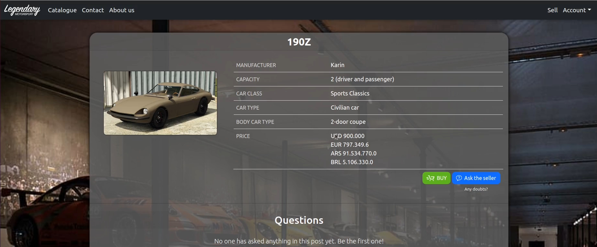
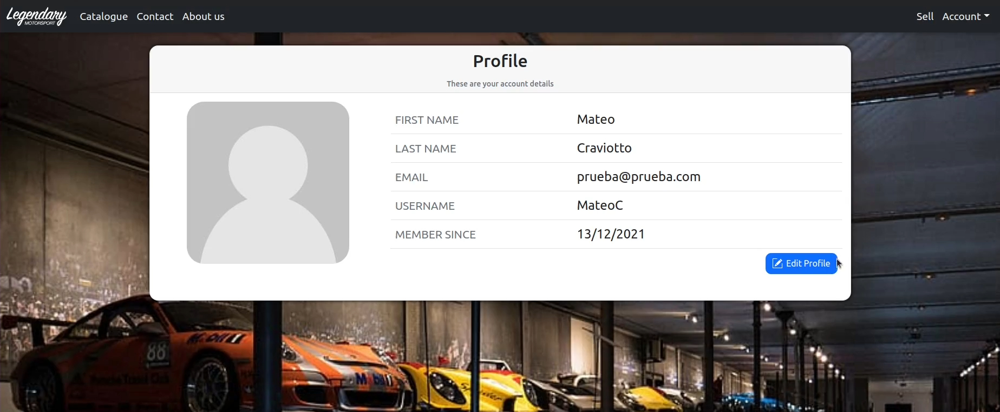
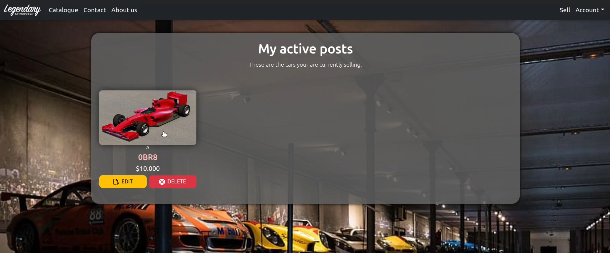

<div align="center">


</div>

# Trabajo Práctico - Teoría del Lenguaje

[](https://github.com/walgab/Legendary_Motorsport#readme)

Proyecto de Ecommerce desarrollado en Ruby on Rails - Trabajo práctico para la materia Teoría de Lenguaje [75.31 - 95.07] - FIUBA, 2C 2021.

## Integrantes:
- Balmaceda, Fernando - [ferbalmaceda23](https://github.com/ferbalmaceda23)
- Craviotto, Mateo - [MateoCraviotto](https://github.com/MateoCraviotto)
- Diem, Walter Gabriel - [walgab](https://github.com/walgab)
- Lazzaro, Melina - [Melzr](https://github.com/Melzr)

## Corrector:
- Ferrigno, Leandro

## Ejecución
Una vez realizada la clonación del repositorio, se deberán instalar los programas necesarios para poder ejecutar el trabajo. Entre ellos, se encuentran:

- Ruby (versión 3.0.0)
- Ruby on Rails (versión 6.1.4.1)
- MySQL y MySQLd (mysql2 versión 0.5) 

Además, se deben instalar las dependencias de NodeJS, requeridas para que funcione Ruby on Rails, con el comando ```yarn install```.
<br><br>

### Instalación de Gemas
Se deben instalar las Gemas utilizadas con el comando ```bundle install```.
Para más detalles sobre las gemas y sus versiones, ver el [gemfile](https://github.com/MateoCraviotto/TP-Ruby-TDL/blob/main/ecommerce/Gemfile).
<br><br>

### Configuración de la base de datos

Primero, se debe ejecutar el setup de la base de datos, que carga los datos del archivo ```seeds.rb``` al inicio, para que aparezca una cuenta administradora con autos precargados al iniciar el servidor. Esto se hace con el comando ```rails db:setup```.

Luego, se deberán ejecutar las migraciones de la base de datos, lo que se hace con el comando ```rails db:migrate```.
<br><br>

### Ejecución del servidor

Finalmente, para ejecutar el servidor que muestra el sitio web en local, se debe ejecutar el comando ```rails s```.

Esto iniciará el servidor para que el sitio web se vea en ```http://localhost:3000/```.

## Imágenes







