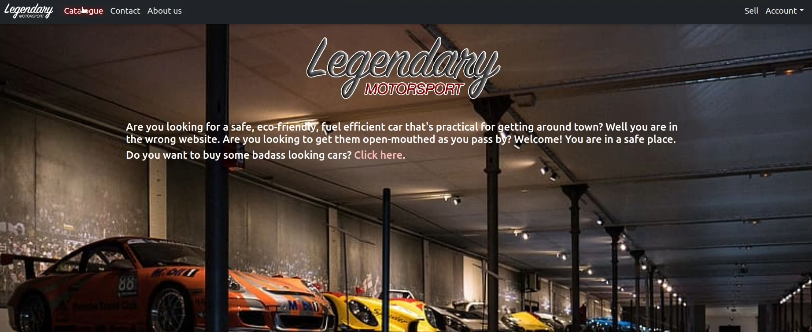
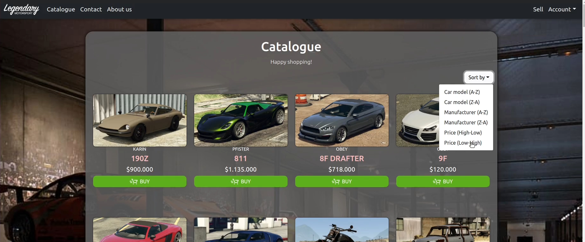
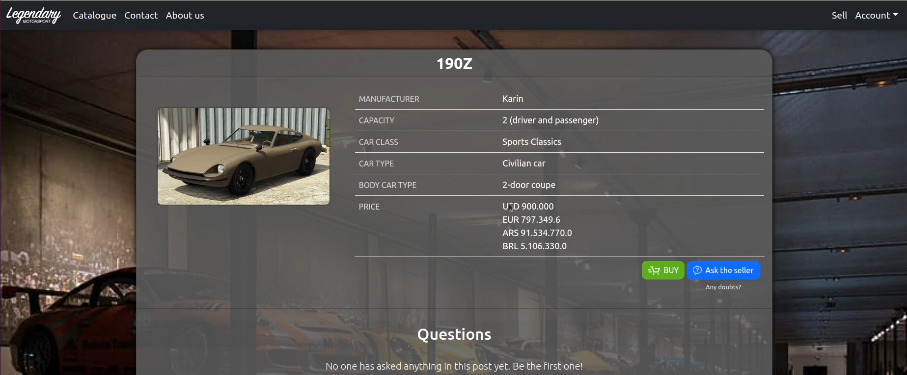
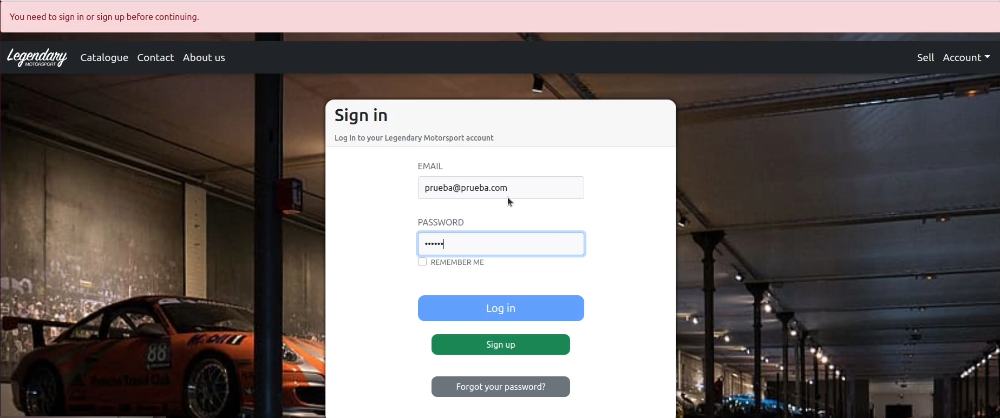
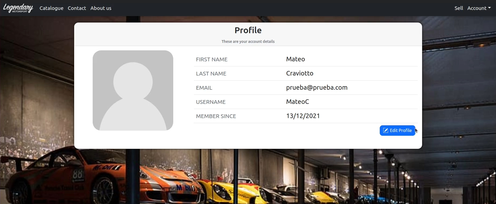
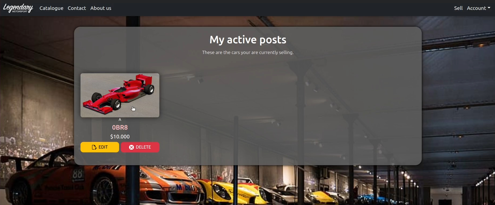

<div align="center">


</div>

# Project - Programming Language Theory

[](https://github.com/walgab/Legendary_Motorsport/blob/main/README.es.md)

Ecommerce project developed in Ruby on Rails - Project for the Programming Language Theory subject [75.31 - 95.07] Ferrigno's course - FIUBA, 2Q 2021.

You can watch the video presentation that goes along with this project [in this YT video](https://youtu.be/-0cxWvMj58c), it's in Spanish as that is the language the course is teached on.

## Project members:
- Balmaceda, Fernando - [ferbalmaceda23](https://github.com/ferbalmaceda23)
- Craviotto, Mateo - [MateoCraviotto](https://github.com/MateoCraviotto)
- Diem, Walter Gabriel - [gabrieldiem](https://github.com/gabrieldiem)
- Lazzaro, Melina - [Melzr](https://github.com/Melzr)

## Evaluator:
- Ferrigno, Leandro

## Execution
Once the repository has been cloned, the necessary programs must be installed to run the work. Among them are:

- Ruby (version 3.0.0)
- Ruby on Rails (version 6.1.4.1)
- MySQL and MySQLd (mysql2 version 0.5) 

In addition, the NodeJS dependencies required for Ruby on Rails to work must be installed with the command ```yarn install```.
<br><br>

### Gem Installation
The used gems must be installed with the command ```bundle install```.
For more details on the gems and their versions, see the [gemfile](https://github.com/MateoCraviotto/TP-Ruby-TDL/blob/main/ecommerce/Gemfile).
<br><br>

### Configuración de la base de datos

First, the database setup must be run, which loads the data from the ```seeds.rb``` file at the beginning, so that an administrator account with preloaded cars appears when starting the server. This is done with the command  ```rails db:setup```.

Then, the database migrations must be executed, which is done with the command ```rails db:migrate```.
<br><br>

### Server Execution

Finally, to run the server that shows the website locally, the command ```rails s``` must be executed.

This will start the server so that the website can be seen at ```http://localhost:3000/```.

## Images












